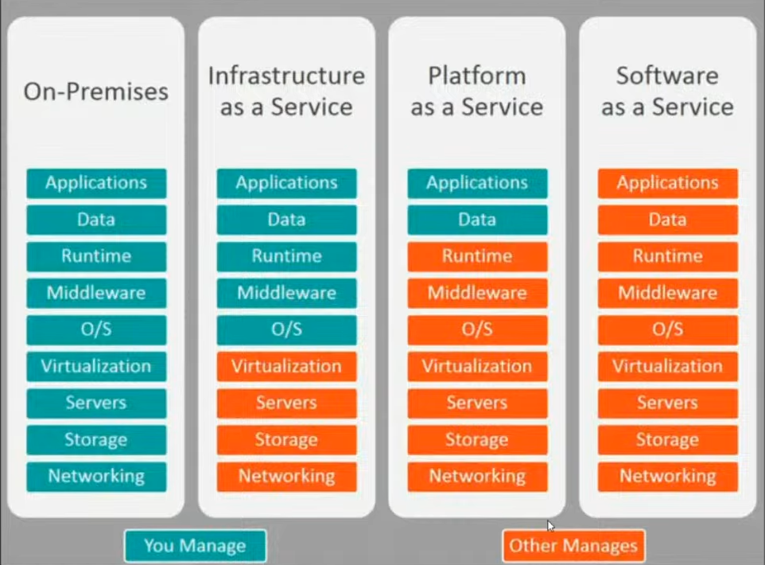

# Introdução Cloud e AWS

Data Center e Recursos computacionais em uma empresa de Cloud provider, com serviços pagos conforme a demanda.

AWS, GCP, Azure, Oracle, Digital Ocean, IBM...

## Tipos de serviços

- On - Premisses (Local)
- Em núvem:
1. Infrastructure as a Service (IaaS)
2. Platform as a Service (PaaS)
3. Software as a Service (SaaS)

